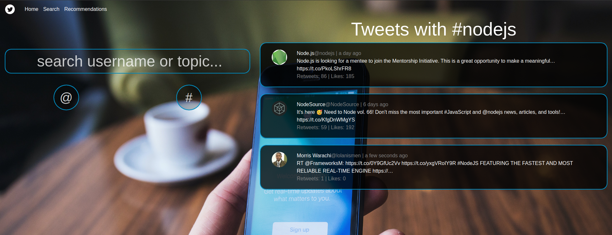
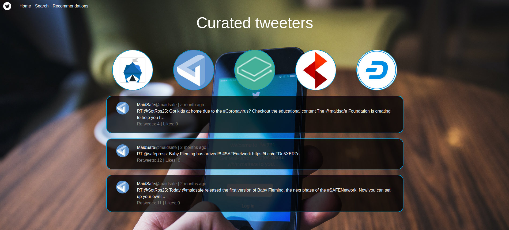

# Tweet_Find
A full-stack web application that allows users to search for recent tweets by username or topic.

Try it out on Heroku <a href="https://tweet-find.herokuapp.com/" target="_blank">HERE</a>.

## Summary
I made a concious effort to take full advantage of tools like npm, concurrently, nodemon, and watch-build during devolopment. Learning how to interact with TwitterAPI was certainly the most challenging, but see all those connections come togeth from front to back is always worth it. 

&nbsp;&nbsp;
&nbsp;&nbsp;
&nbsp;&nbsp;
&nbsp;&nbsp;
&nbsp;&nbsp;

## How to run on local machine

- Install Node/npm https://nodejs.org/
- Using your [Twitter developer account](https://developer.twitter.com) , you will need to "Create an app".
- Assign your public and private Consumer API keys to the variables defined in `.env`.
- From the root directory, run: `npm install`
- From /client run: `npm install`
- From the root directory run: `npm run dev`

## Author

* **Mike McGrain** - *Full-Stack Software Developement* - [Website](http://mikemcgrain.com) | [LinkedIn](https://www.linkedin.com/in/michaelmcgrain)